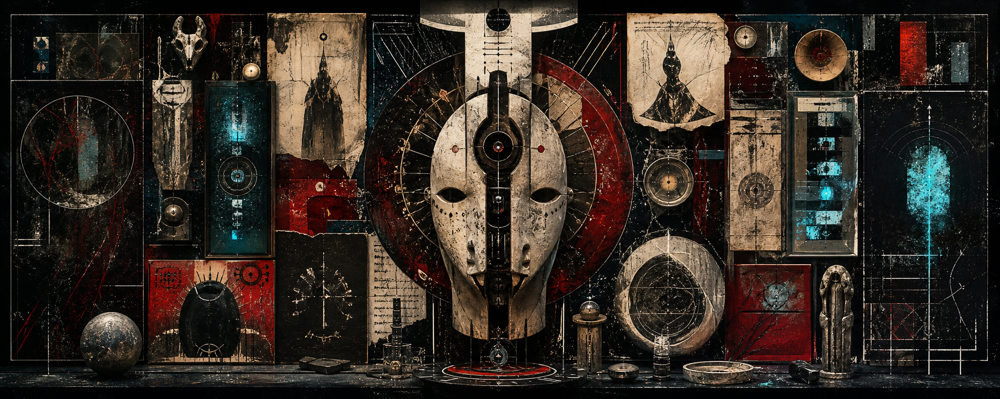

  

<h1 align="center">NO HAGO PORTFOLIO. HAGO EVIDENCIA.</h1>

  <i>ritualista visual / coleccionista de anomalías / operador de belleza inestable</i>

  ruido &nbsp; / &nbsp; símbolo &nbsp; / &nbsp; carne &nbsp; / &nbsp; interfaz &nbsp; / &nbsp; archivo &nbsp; / &nbsp; exceso

---

## manifiesto

no soy developer.  
soy una interferencia con cuenta de github.

hago imágenes como si fueran pruebas forenses de un sueño.

colecciono ruido, símbolos, texturas, errores, máscaras, santos falsos,
interfaces rotas, belleza incómoda y objetos que parecen venir de una
religión que todavía no existe.

este espacio no es un portafolio.  
es un cuarto cerrado.  
una vitrina sucia.  
un mapa de obsesiones.  
una transmisión que no sabe si quiere ser archivo, altar o amenaza.

---

## tech stack

  
  
  
  
  
  
  
  

---

## materiales recurrentes

- cuerpos sin biografía
- objetos con aura
- glitches emocionales
- estética ritual
- iconografía inventada
- lujo contaminado
- software como superficie
- imágenes que parecen recordar algo que nunca pasó

---

## declaración

no me interesa verme profesional.  
me interesa verme inevitable.

no organizo proyectos.  
acumulo señales.

no busco explicar la obra.  
busco dejar residuos.

---

  
    archivo viviente de ruido, símbolos y accidentes visuales
  

