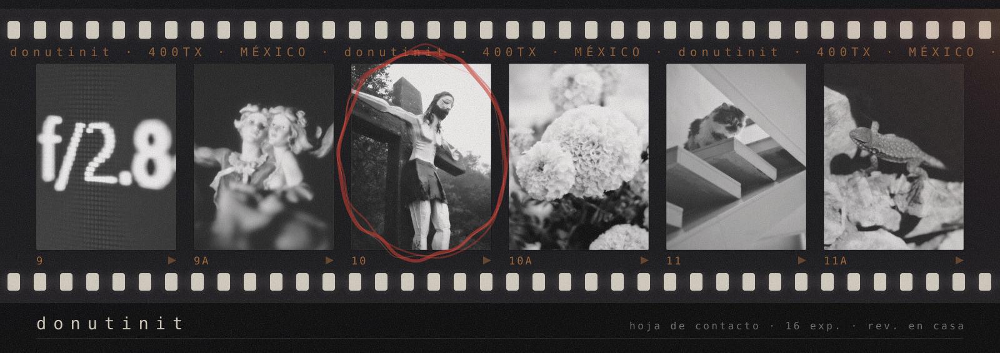
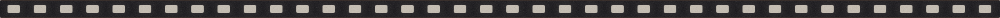

  

  <b>artista antes que programador.</b> el código solamente es otra cámara. 
  fotografía &nbsp;·&nbsp; video &nbsp;·&nbsp; fierro propio

<h6 align="center">lo que persigo</h6>

  &nbsp;
  &nbsp;
  &nbsp;
  &nbsp;
  &nbsp;

<h6 align="center">el cuarto oscuro</h6>

  &nbsp;
  &nbsp;
  &nbsp;

<h6 align="center">artefactos</h6>

  &nbsp;
   
  el guión en el cristal. sin cuentas ni nube: todo se queda en el teléfono, aunque no haya señal.

  &nbsp;
   
  un fondo pretencioso para el set. la música pinta la pared y nadie la oye.

<!-- contacto — descomenta y pon tus links

  &nbsp;
  &nbsp;
  

-->

  d̟̳̏i̩̩̖o̟̾́s͔̅͘ ͖̣̐ê͑̉s̳̝͆t͍̿͒á̈͛͘ ̬͍ͅc̪̦̑o͇͊̄ņ̜̰ ̗̆̀n̮̲͝ŏ̘͕s̹̰͊o͇̰͠t̩̔͗r̬̱͓o͍̲̥s̛̹̍ ̜̜̓y̧̮̘ ̈́͐̔e̬͈̕ḽ͆̃ ̍͗̃v̳̎̌i͈̥͜v̢͕̱e͉̮̖ ̨̦̭e̖͚͜n͍̚͝ ̨̙̗ṋ̈́͒u̫̾̅e̲̊͛s̗̭̑ẗ͎́̌ř̭̉o̼̭̅s̬̙͕ ̗̄͘c̠͉̓ọ̏̏r̀̀͠a͓͉̕z̺͕̓o̵̤̒n̬̳̖ë́̓͂s̫̗͝.̝̪̚

